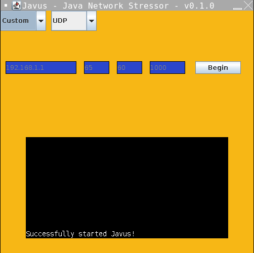
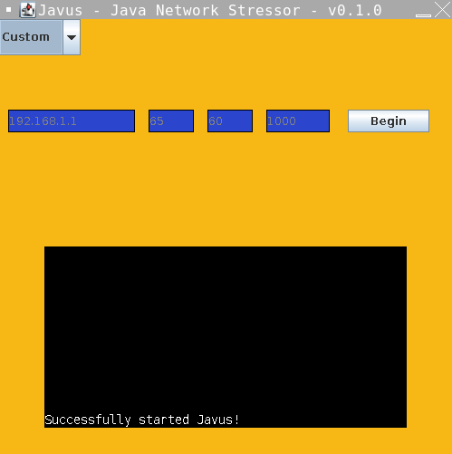

#### v0.0.1 (January 25, 2024)
<pre>
- Added input for:
    IP
    Packet size
    Delay
    Time
- Added dropdown for target
- Added begin button</pre>

#### v0.1.0
<pre>
- Added protocol type dropdown
- Added terminal
- Added PRT (Process in Real Terminal)</pre>

#### v0.1.1
<pre>
- Removed protocol type dropdown</pre>

#### v0.2.0
<pre>
- Added protocol dropdown
- Added threading
- Bug fixed
- Made closing door no longer request bug report   /////// NEEEEEED ///////</pre>
